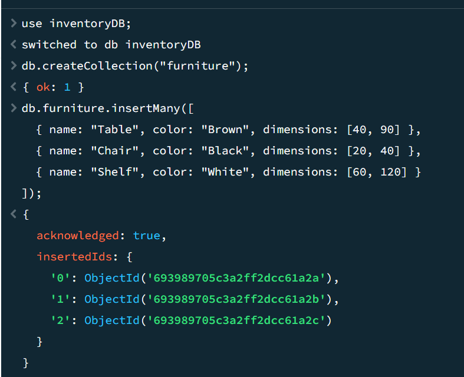
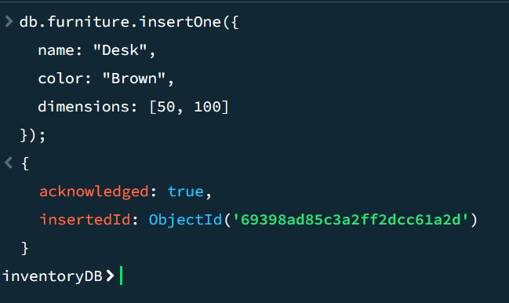
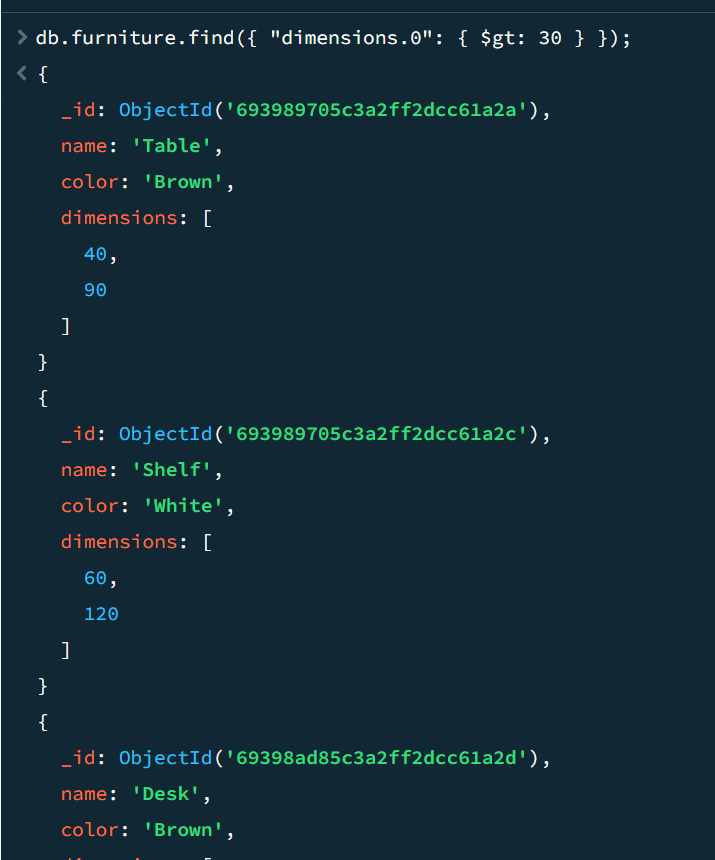
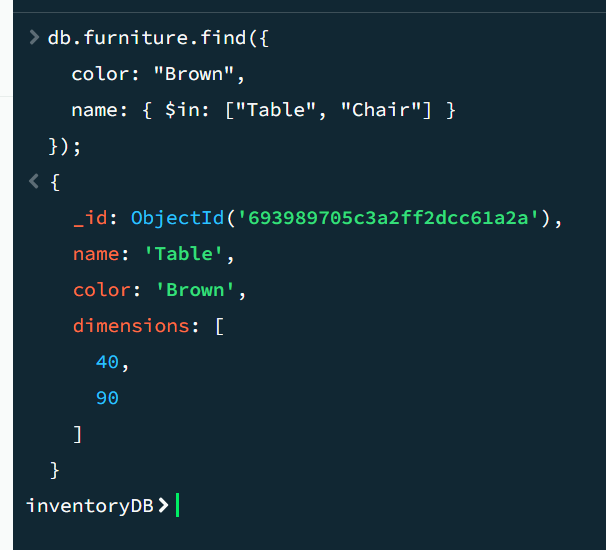
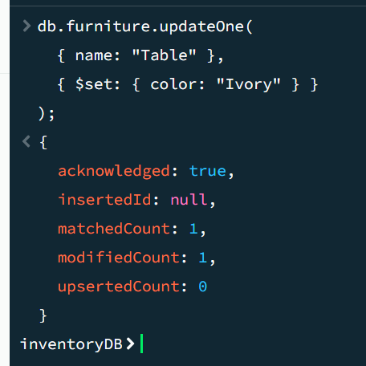
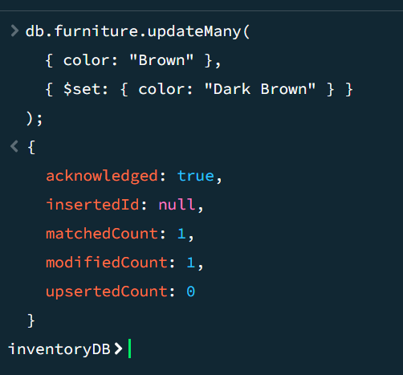
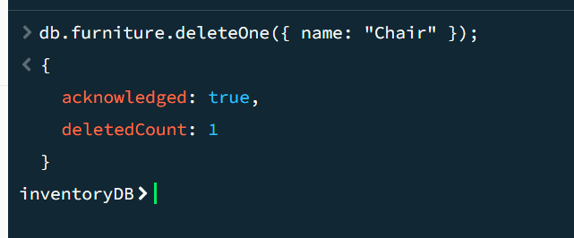
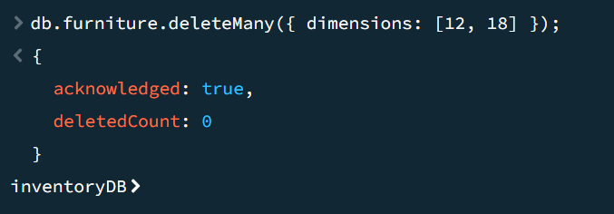
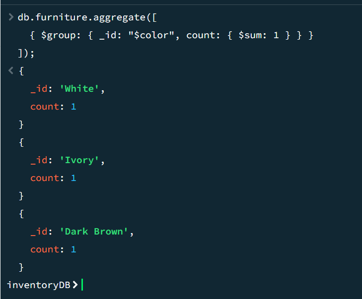
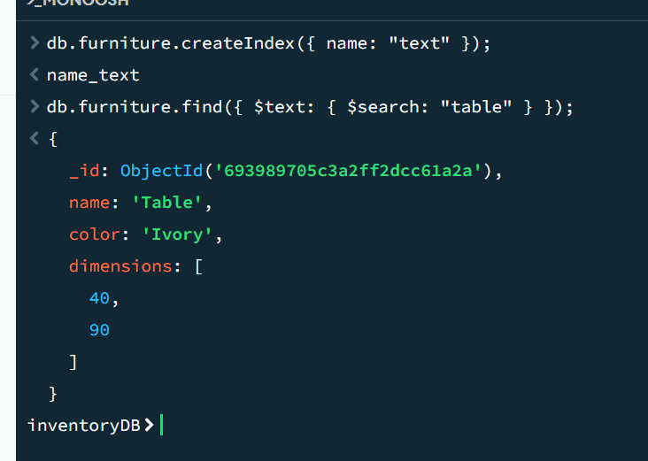

#### Q1
```js
> use inventoryDB;

> db.createCollection("furniture");

> db.furniture.insertMany([
    { name: "Table", color: "Brown", dimensions: [40, 90] },
    { name: "Chair", color: "Black", dimensions: [20, 40] },
    { name: "Shelf", color: "White", dimensions: [60, 120] }
  ]);
```


#### Q2
```js
> db.furniture.insertOne({
    name: "Desk",
    color: "Brown",
    dimensions: [50, 100]
  });
```


#### Q3
```js
> db.furniture.find({ "dimensions.0": { $gt: 30 } });
```


#### Q4
```js
> db.furniture.find({
    color: "Brown",
    name: { $in: ["Table", "Chair"] }
  });
```


#### Q5
```js
> db.furniture.updateOne(
    { name: "Table" },
    { $set: { color: "Ivory" } }
  );
```


#### Q6
```js
> db.furniture.updateMany(
    { color: "Brown" },
    { $set: { color: "Dark Brown" } }
  );
```


#### Q7
```js
> db.furniture.deleteOne({ name: "Chair" });
```


#### Q8
```js
> db.furniture.deleteMany({ dimensions: [12, 18] });
```


#### Q9
```js
> db.furniture.aggregate([
    { $group: { _id: "$color", count: { $sum: 1 } } }
  ]);
```


#### Q10
```js
> db.furniture.createIndex({ name: "text" });

> db.furniture.find({ $text: { $search: "table" } });
```
